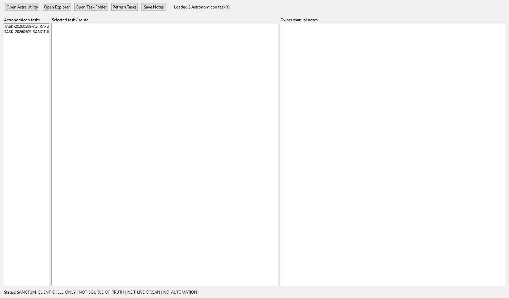
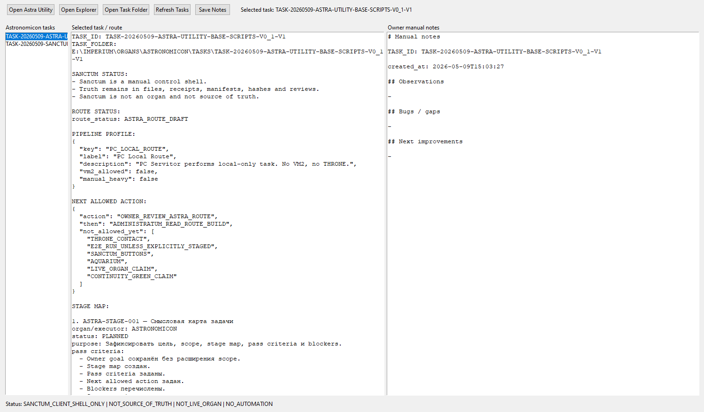
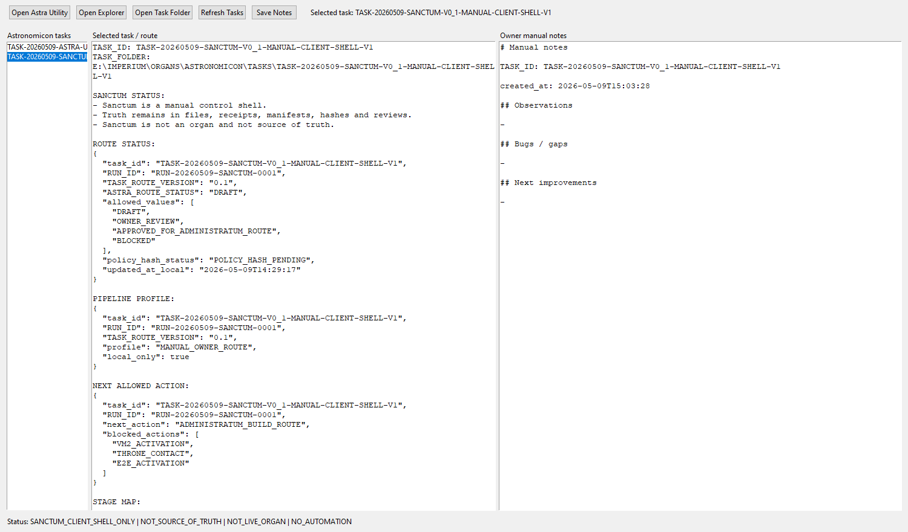
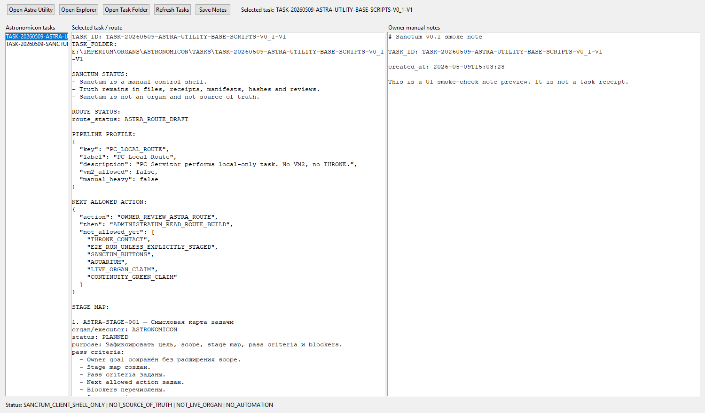

# Sanctum v0.1 Smoke Screenshot Gallery

RUN_ID: `SANCTUM-SMOKE-20260509-150325`
VERDICT: `PASS_SANCTUM_V0_1_SMOKE_SCREENSHOT_CHECK`

## 01_start.png

- label: `start`

## 02_refreshed_task_list.png

- label: `refreshed_task_list`

## 03_task_01.png

- label: `task_01`
- task_id: `TASK-20260509-ASTRA-UTILITY-BASE-SCRIPTS-V0_1-V1`

## 04_task_02.png

- label: `task_02`
- task_id: `TASK-20260509-SANCTUM-V0_1-MANUAL-CLIENT-SHELL-V1`

## 05_notes_preview.png

- label: `notes_preview`
- task_id: `TASK-20260509-ASTRA-UTILITY-BASE-SCRIPTS-V0_1-V1`

