# IMPERIUM Explorer Screenshot Gallery

RUN_ID: `AUTO-RUN-V1_0A-20260509-120030`
VERDICT: `PASS_AUTOSCREENSHOT_TRUTH_COMPARE`

## Screenshots

### 001_IMPERIUM.png

- path: `E:\IMPERIUM`
- source: `truth_audit.critical_paths`
- select_status: `SELECTED`
- `PASS` visible_path_matches_target expected=`E:\IMPERIUM`
- `PASS` visible_type_matches_truth_audit expected=`IMPERIUM_ROOT`
- `PASS` visible_direct_folders_matches_truth_audit expected=`6`
- `PASS` visible_direct_files_matches_truth_audit expected=`0`

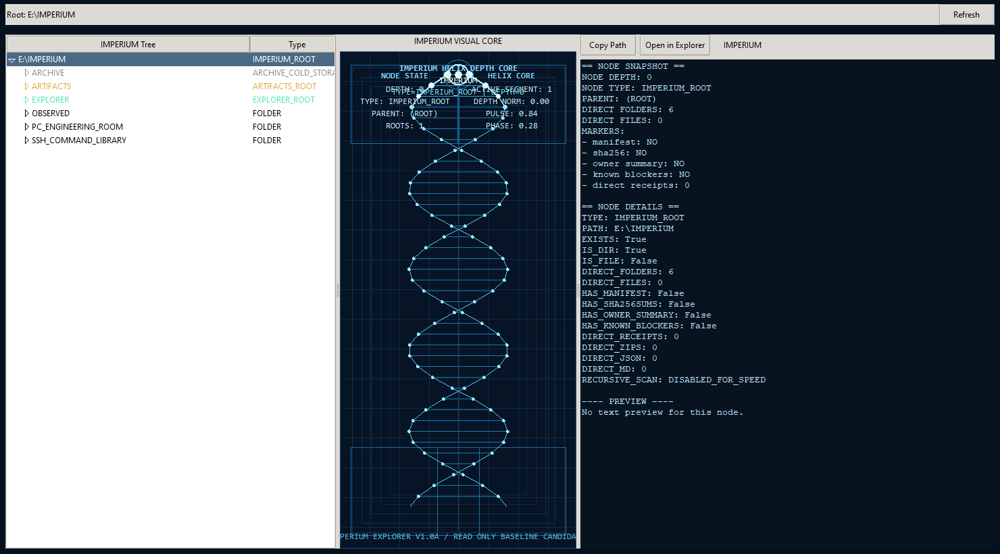

### 002_ARTIFACTS.png

- path: `E:\IMPERIUM\ARTIFACTS`
- source: `truth_audit.critical_paths`
- select_status: `SELECTED`
- `PASS` visible_path_matches_target expected=`E:\IMPERIUM\ARTIFACTS`
- `PASS` visible_type_matches_truth_audit expected=`ARTIFACTS_ROOT`
- `PASS` visible_direct_folders_matches_truth_audit expected=`29`
- `PASS` visible_direct_files_matches_truth_audit expected=`5`

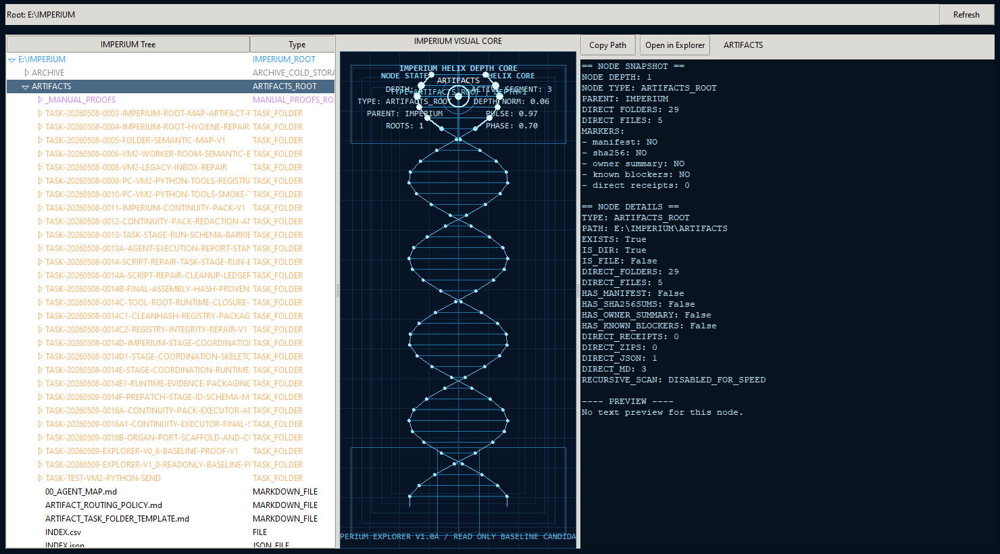

### 003__MANUAL_PROOFS.png

- path: `E:\IMPERIUM\ARTIFACTS\_MANUAL_PROOFS`
- source: `truth_audit.critical_paths`
- select_status: `SELECTED`
- `PASS` visible_path_matches_target expected=`E:\IMPERIUM\ARTIFACTS\_MANUAL_PROOFS`
- `PASS` visible_type_matches_truth_audit expected=`MANUAL_PROOFS_ROOT`
- `PASS` visible_direct_folders_matches_truth_audit expected=`5`
- `PASS` visible_direct_files_matches_truth_audit expected=`4`

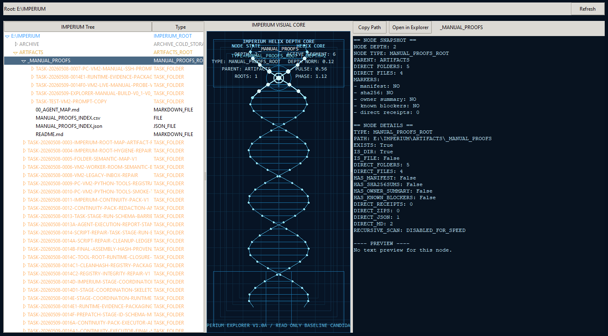

### 004_EXPLORER.png

- path: `E:\IMPERIUM\EXPLORER`
- source: `truth_audit.critical_paths`
- select_status: `SELECTED`
- `PASS` visible_path_matches_target expected=`E:\IMPERIUM\EXPLORER`
- `PASS` visible_type_matches_truth_audit expected=`EXPLORER_ROOT`
- `PASS` visible_direct_folders_matches_truth_audit expected=`3`
- `PASS` visible_direct_files_matches_truth_audit expected=`10`

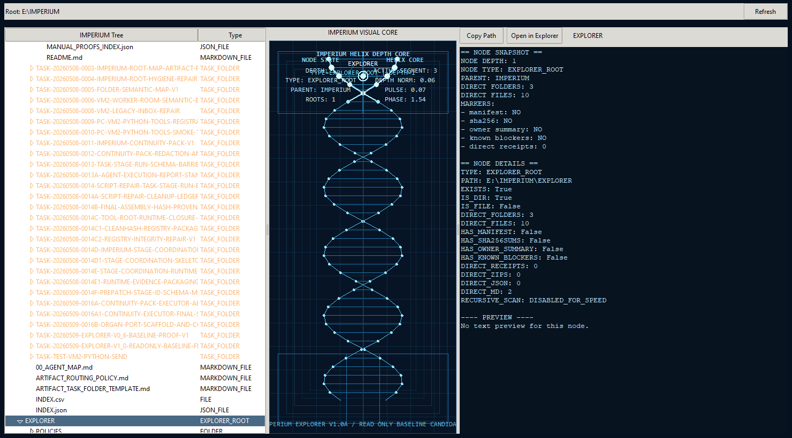

### 005_README_md.png

- path: `E:\IMPERIUM\EXPLORER\README.md`
- source: `truth_audit.critical_paths`
- select_status: `SELECTED`
- `PASS` visible_path_matches_target expected=`E:\IMPERIUM\EXPLORER\README.md`
- `PASS` visible_type_matches_truth_audit expected=`MARKDOWN_FILE`

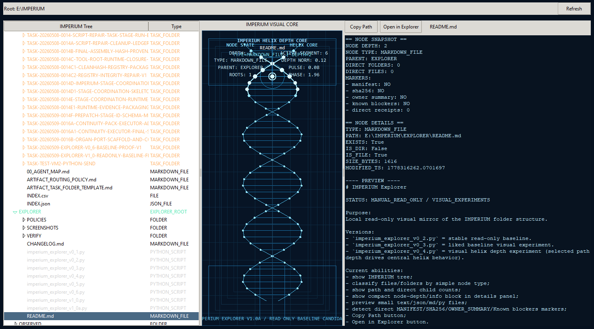

### 006_CHANGELOG_md.png

- path: `E:\IMPERIUM\EXPLORER\CHANGELOG.md`
- source: `truth_audit.critical_paths`
- select_status: `SELECTED`
- `PASS` visible_path_matches_target expected=`E:\IMPERIUM\EXPLORER\CHANGELOG.md`
- `PASS` visible_type_matches_truth_audit expected=`MARKDOWN_FILE`

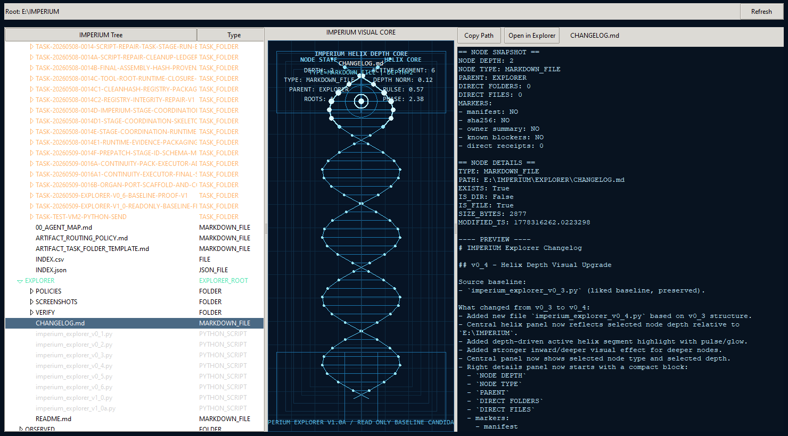

### 007_imperium_explorer_v1_0a_py.png

- path: `E:\IMPERIUM\EXPLORER\imperium_explorer_v1_0a.py`
- source: `truth_audit.critical_paths`
- select_status: `SELECTED`
- `PASS` visible_path_matches_target expected=`E:\IMPERIUM\EXPLORER\imperium_explorer_v1_0a.py`
- `PASS` visible_type_matches_truth_audit expected=`PYTHON_SCRIPT`

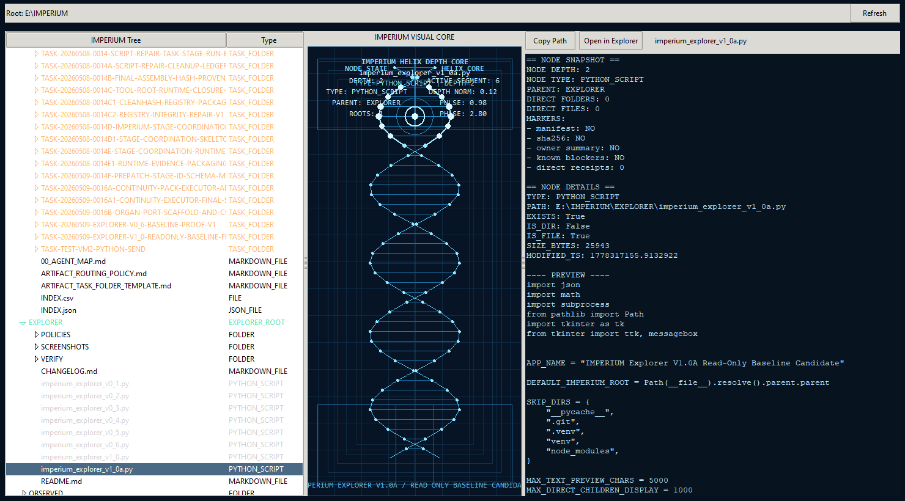

### 008_EXPLORER_BASELINE_POLICY_json.png

- path: `E:\IMPERIUM\EXPLORER\POLICIES\EXPLORER_BASELINE_POLICY.json`
- source: `truth_audit.critical_paths`
- select_status: `SELECTED`
- `PASS` visible_path_matches_target expected=`E:\IMPERIUM\EXPLORER\POLICIES\EXPLORER_BASELINE_POLICY.json`
- `PASS` visible_type_matches_truth_audit expected=`JSON_FILE`

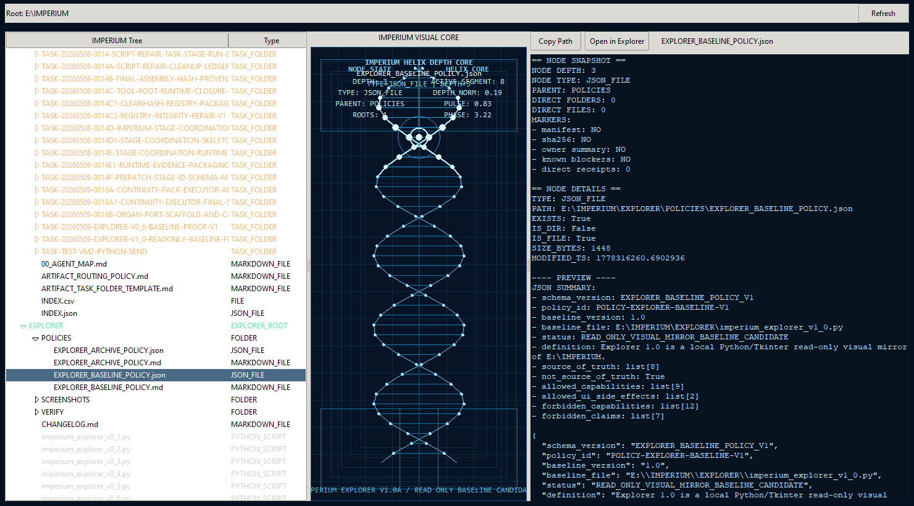

### 009_EXPLORER_BASELINE_POLICY_md.png

- path: `E:\IMPERIUM\EXPLORER\POLICIES\EXPLORER_BASELINE_POLICY.md`
- source: `truth_audit.critical_paths`
- select_status: `SELECTED`
- `PASS` visible_path_matches_target expected=`E:\IMPERIUM\EXPLORER\POLICIES\EXPLORER_BASELINE_POLICY.md`
- `PASS` visible_type_matches_truth_audit expected=`MARKDOWN_FILE`

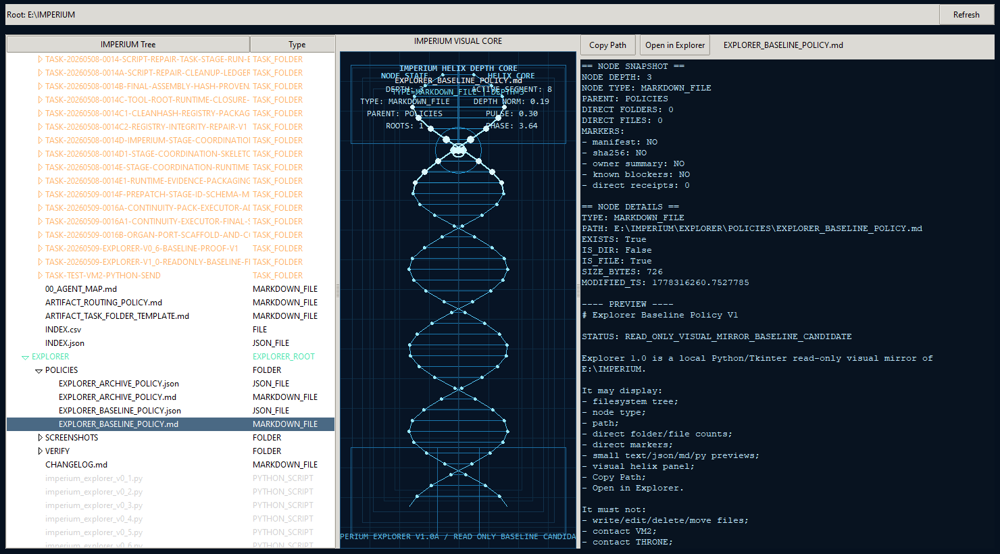

### 010_EXPLORER_ARCHIVE_POLICY_json.png

- path: `E:\IMPERIUM\EXPLORER\POLICIES\EXPLORER_ARCHIVE_POLICY.json`
- source: `truth_audit.critical_paths`
- select_status: `SELECTED`
- `PASS` visible_path_matches_target expected=`E:\IMPERIUM\EXPLORER\POLICIES\EXPLORER_ARCHIVE_POLICY.json`
- `PASS` visible_type_matches_truth_audit expected=`JSON_FILE`

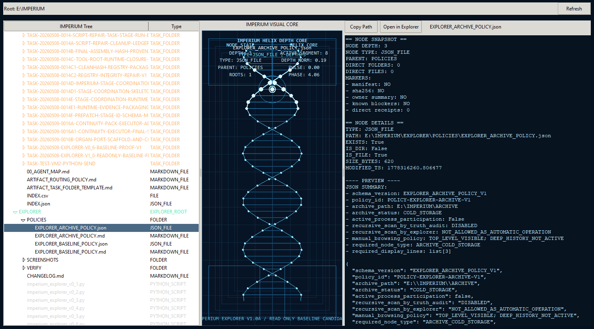

### 011_EXPLORER_ARCHIVE_POLICY_md.png

- path: `E:\IMPERIUM\EXPLORER\POLICIES\EXPLORER_ARCHIVE_POLICY.md`
- source: `truth_audit.critical_paths`
- select_status: `SELECTED`
- `PASS` visible_path_matches_target expected=`E:\IMPERIUM\EXPLORER\POLICIES\EXPLORER_ARCHIVE_POLICY.md`
- `PASS` visible_type_matches_truth_audit expected=`MARKDOWN_FILE`

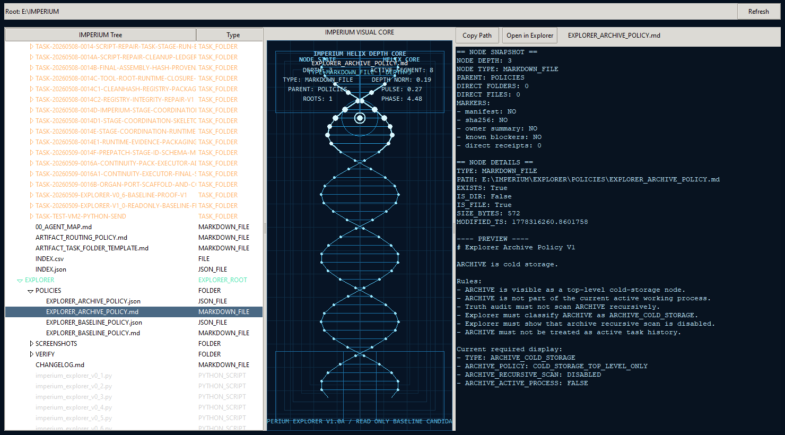

### 012_ARCHIVE.png

- path: `E:\IMPERIUM\ARCHIVE`
- source: `truth_audit.archive_top_index`
- select_status: `SELECTED`
- `PASS` visible_path_matches_target expected=`E:\IMPERIUM\ARCHIVE`
- `PASS` visible_type_is_ARCHIVE_COLD_STORAGE expected=`ARCHIVE_COLD_STORAGE`
- `PASS` visible_ARCHIVE_POLICY_line expected=`ARCHIVE_POLICY: COLD_STORAGE_TOP_LEVEL_ONLY`
- `PASS` visible_ARCHIVE_RECURSIVE_SCAN_line expected=`ARCHIVE_RECURSIVE_SCAN: DISABLED`
- `PASS` visible_ARCHIVE_ACTIVE_PROCESS_line expected=`ARCHIVE_ACTIVE_PROCESS: FALSE`
- `PASS` visible_direct_folders_matches_truth_audit expected=`2`
- `PASS` visible_direct_files_matches_truth_audit expected=`0`

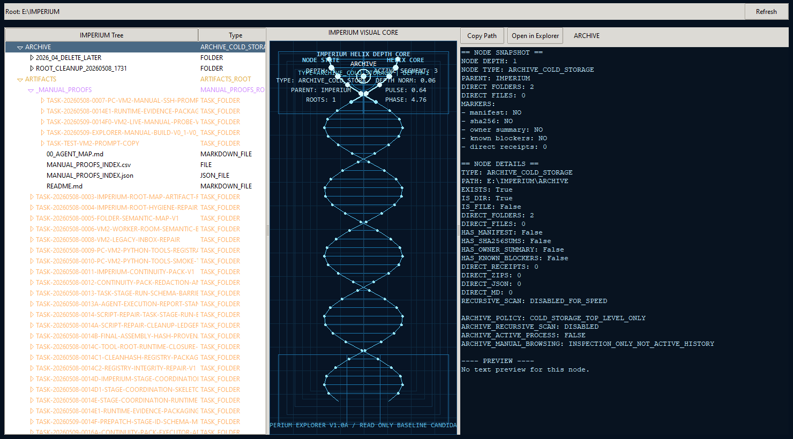

### 013_TASK-20260508-0003-IMPERIUM-ROOT-MAP-ARTIFACT-ROUTING.png

- path: `E:\IMPERIUM\ARTIFACTS\TASK-20260508-0003-IMPERIUM-ROOT-MAP-ARTIFACT-ROUTING`
- source: `truth_audit.sample_task_folders`
- select_status: `SELECTED`
- `PASS` visible_path_matches_target expected=`E:\IMPERIUM\ARTIFACTS\TASK-20260508-0003-IMPERIUM-ROOT-MAP-ARTIFACT-ROUTING`

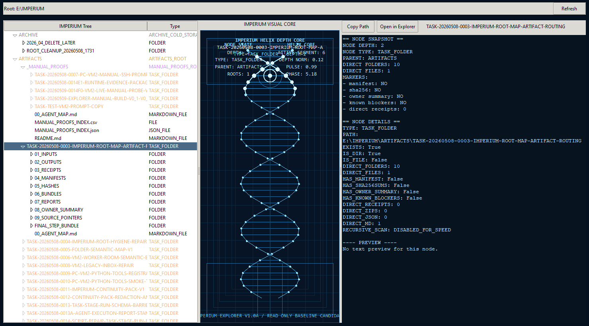

### 014_TASK-20260508-0004-IMPERIUM-ROOT-HYGIENE-REPAIR.png

- path: `E:\IMPERIUM\ARTIFACTS\TASK-20260508-0004-IMPERIUM-ROOT-HYGIENE-REPAIR`
- source: `truth_audit.sample_task_folders`
- select_status: `SELECTED`
- `PASS` visible_path_matches_target expected=`E:\IMPERIUM\ARTIFACTS\TASK-20260508-0004-IMPERIUM-ROOT-HYGIENE-REPAIR`

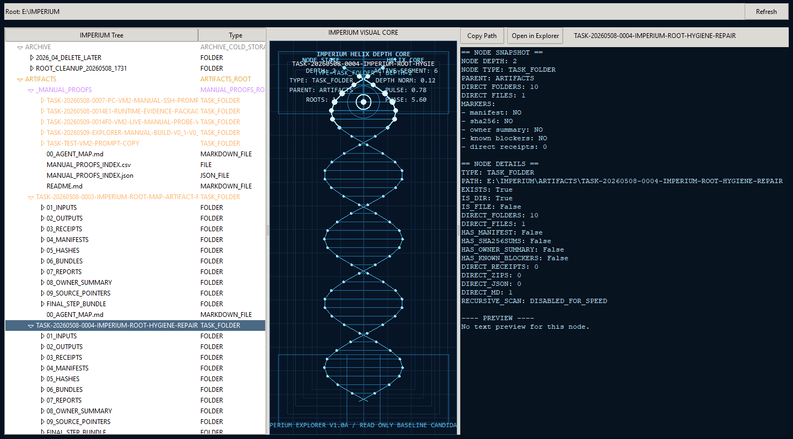

### 015_TASK-20260508-0005-FOLDER-SEMANTIC-MAP-V1.png

- path: `E:\IMPERIUM\ARTIFACTS\TASK-20260508-0005-FOLDER-SEMANTIC-MAP-V1`
- source: `truth_audit.sample_task_folders`
- select_status: `SELECTED`
- `PASS` visible_path_matches_target expected=`E:\IMPERIUM\ARTIFACTS\TASK-20260508-0005-FOLDER-SEMANTIC-MAP-V1`

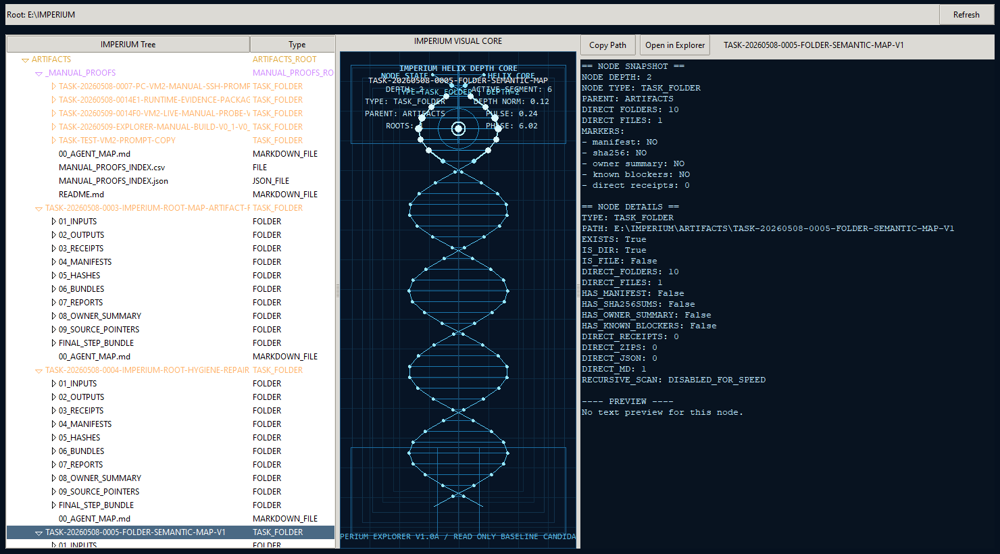

### 016_TASK-20260508-0006-VM2-WORKER-ROOM-SEMANTIC-BOOTSTRAP.png

- path: `E:\IMPERIUM\ARTIFACTS\TASK-20260508-0006-VM2-WORKER-ROOM-SEMANTIC-BOOTSTRAP`
- source: `truth_audit.sample_task_folders`
- select_status: `SELECTED`
- `PASS` visible_path_matches_target expected=`E:\IMPERIUM\ARTIFACTS\TASK-20260508-0006-VM2-WORKER-ROOM-SEMANTIC-BOOTSTRAP`

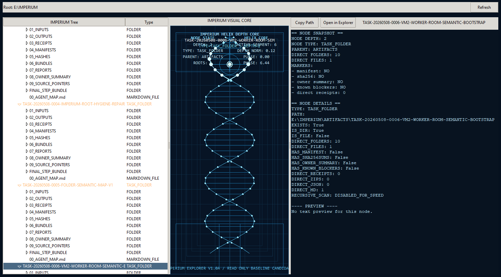

### 017_TASK-20260508-0008-VM2-LEGACY-INBOX-REPAIR.png

- path: `E:\IMPERIUM\ARTIFACTS\TASK-20260508-0008-VM2-LEGACY-INBOX-REPAIR`
- source: `truth_audit.sample_task_folders`
- select_status: `SELECTED`
- `PASS` visible_path_matches_target expected=`E:\IMPERIUM\ARTIFACTS\TASK-20260508-0008-VM2-LEGACY-INBOX-REPAIR`

### 018_TASK-20260508-0009-PC-VM2-PYTHON-TOOLS-REGISTRATION.png

- path: `E:\IMPERIUM\ARTIFACTS\TASK-20260508-0009-PC-VM2-PYTHON-TOOLS-REGISTRATION`
- source: `truth_audit.sample_task_folders`
- select_status: `SELECTED`
- `PASS` visible_path_matches_target expected=`E:\IMPERIUM\ARTIFACTS\TASK-20260508-0009-PC-VM2-PYTHON-TOOLS-REGISTRATION`

### 019_TASK-20260508-0010-PC-VM2-PYTHON-TOOLS-SMOKE-TEST.png

- path: `E:\IMPERIUM\ARTIFACTS\TASK-20260508-0010-PC-VM2-PYTHON-TOOLS-SMOKE-TEST`
- source: `truth_audit.sample_task_folders`
- select_status: `SELECTED`
- `PASS` visible_path_matches_target expected=`E:\IMPERIUM\ARTIFACTS\TASK-20260508-0010-PC-VM2-PYTHON-TOOLS-SMOKE-TEST`

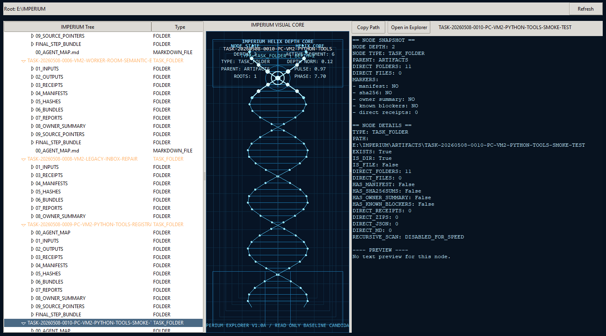

### 020_TASK-20260508-0011-IMPERIUM-CONTINUITY-PACK-V1.png

- path: `E:\IMPERIUM\ARTIFACTS\TASK-20260508-0011-IMPERIUM-CONTINUITY-PACK-V1`
- source: `truth_audit.sample_task_folders`
- select_status: `SELECTED`
- `PASS` visible_path_matches_target expected=`E:\IMPERIUM\ARTIFACTS\TASK-20260508-0011-IMPERIUM-CONTINUITY-PACK-V1`

### 021_TASK-20260508-0012-CONTINUITY-PACK-REDACTION-AND-PROTOCOL-REPAIR-V1.png

- path: `E:\IMPERIUM\ARTIFACTS\TASK-20260508-0012-CONTINUITY-PACK-REDACTION-AND-PROTOCOL-REPAIR-V1`
- source: `truth_audit.sample_task_folders`
- select_status: `SELECTED`
- `PASS` visible_path_matches_target expected=`E:\IMPERIUM\ARTIFACTS\TASK-20260508-0012-CONTINUITY-PACK-REDACTION-AND-PROTOCOL-REPAIR-V1`

### 022_TASK-20260508-0013-TASK-STAGE-RUN-SCHEMA-BARRIER-AND-PROVENANCE-V1.png

- path: `E:\IMPERIUM\ARTIFACTS\TASK-20260508-0013-TASK-STAGE-RUN-SCHEMA-BARRIER-AND-PROVENANCE-V1`
- source: `truth_audit.sample_task_folders`
- select_status: `SELECTED`
- `PASS` visible_path_matches_target expected=`E:\IMPERIUM\ARTIFACTS\TASK-20260508-0013-TASK-STAGE-RUN-SCHEMA-BARRIER-AND-PROVENANCE-V1`

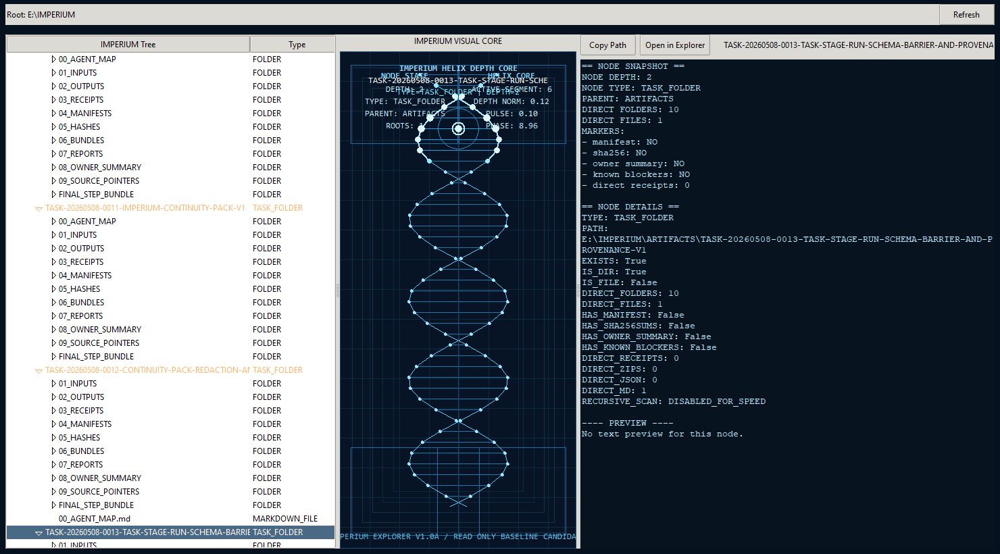

### 023_TASK-20260508-0013A-AGENT-EXECUTION-REPORT-STANDARD-V1.png

- path: `E:\IMPERIUM\ARTIFACTS\TASK-20260508-0013A-AGENT-EXECUTION-REPORT-STANDARD-V1`
- source: `truth_audit.sample_task_folders`
- select_status: `SELECTED`
- `PASS` visible_path_matches_target expected=`E:\IMPERIUM\ARTIFACTS\TASK-20260508-0013A-AGENT-EXECUTION-REPORT-STANDARD-V1`

### 024_TASK-20260508-0014-SCRIPT-REPAIR-TASK-STAGE-RUN-BARRIER-LEDGER-PROVENANCE-V1.png

- path: `E:\IMPERIUM\ARTIFACTS\TASK-20260508-0014-SCRIPT-REPAIR-TASK-STAGE-RUN-BARRIER-LEDGER-PROVENANCE-V1`
- source: `truth_audit.sample_task_folders`
- select_status: `SELECTED`
- `PASS` visible_path_matches_target expected=`E:\IMPERIUM\ARTIFACTS\TASK-20260508-0014-SCRIPT-REPAIR-TASK-STAGE-RUN-BARRIER-LEDGER-PROVENANCE-V1`

### 025_TASK-20260508-0014A-SCRIPT-REPAIR-CLEANUP-LEDGER-FAILURE-RECEIPTS-SHA256-V1.png

- path: `E:\IMPERIUM\ARTIFACTS\TASK-20260508-0014A-SCRIPT-REPAIR-CLEANUP-LEDGER-FAILURE-RECEIPTS-SHA256-V1`
- source: `truth_audit.sample_task_folders`
- select_status: `SELECTED`
- `PASS` visible_path_matches_target expected=`E:\IMPERIUM\ARTIFACTS\TASK-20260508-0014A-SCRIPT-REPAIR-CLEANUP-LEDGER-FAILURE-RECEIPTS-SHA256-V1`

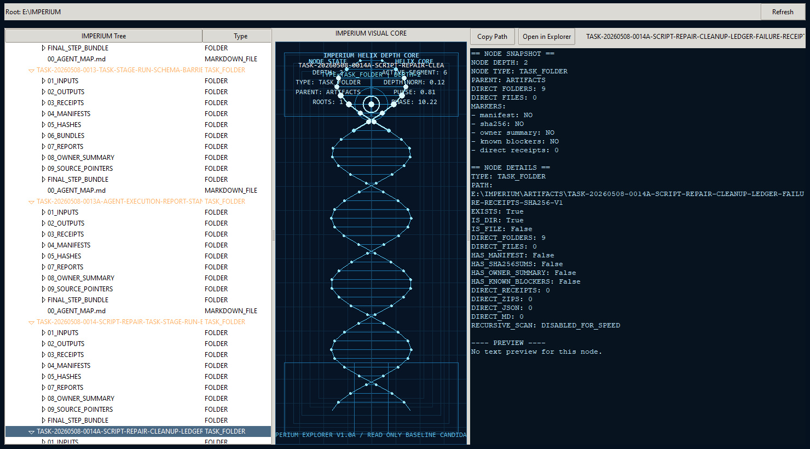

### 026_TASK-20260508-0014B-FINAL-ASSEMBLY-HASH-PROVENANCE-ZIP-HYGIENE-V1.png

- path: `E:\IMPERIUM\ARTIFACTS\TASK-20260508-0014B-FINAL-ASSEMBLY-HASH-PROVENANCE-ZIP-HYGIENE-V1`
- source: `truth_audit.sample_task_folders`
- select_status: `SELECTED`
- `PASS` visible_path_matches_target expected=`E:\IMPERIUM\ARTIFACTS\TASK-20260508-0014B-FINAL-ASSEMBLY-HASH-PROVENANCE-ZIP-HYGIENE-V1`

### 027_TASK-20260508-0014C-TOOL-ROOT-RUNTIME-CLOSURE-ADDRESS-REGISTRY-READONLY-EXPLORER-AND-DRYRUN-PROOF-V1.png

- path: `E:\IMPERIUM\ARTIFACTS\TASK-20260508-0014C-TOOL-ROOT-RUNTIME-CLOSURE-ADDRESS-REGISTRY-READONLY-EXPLORER-AND-DRYRUN-PROOF-V1`
- source: `truth_audit.sample_task_folders`
- select_status: `SELECTED`
- `PASS` visible_path_matches_target expected=`E:\IMPERIUM\ARTIFACTS\TASK-20260508-0014C-TOOL-ROOT-RUNTIME-CLOSURE-ADDRESS-REGISTRY-READONLY-EXPLORER-AND-DRYRUN-PROOF-V1`

### 028_TASK-20260508-0014C1-CLEANHASH-REGISTRY-PACKAGING-REPAIR-V1.png

- path: `E:\IMPERIUM\ARTIFACTS\TASK-20260508-0014C1-CLEANHASH-REGISTRY-PACKAGING-REPAIR-V1`
- source: `truth_audit.sample_task_folders`
- select_status: `SELECTED`
- `PASS` visible_path_matches_target expected=`E:\IMPERIUM\ARTIFACTS\TASK-20260508-0014C1-CLEANHASH-REGISTRY-PACKAGING-REPAIR-V1`

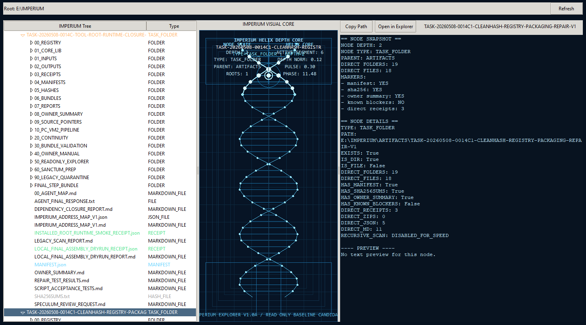

### 029_TASK-20260508-0014C2-REGISTRY-INTEGRITY-REPAIR-V1.png

- path: `E:\IMPERIUM\ARTIFACTS\TASK-20260508-0014C2-REGISTRY-INTEGRITY-REPAIR-V1`
- source: `truth_audit.sample_task_folders`
- select_status: `SELECTED`
- `PASS` visible_path_matches_target expected=`E:\IMPERIUM\ARTIFACTS\TASK-20260508-0014C2-REGISTRY-INTEGRITY-REPAIR-V1`

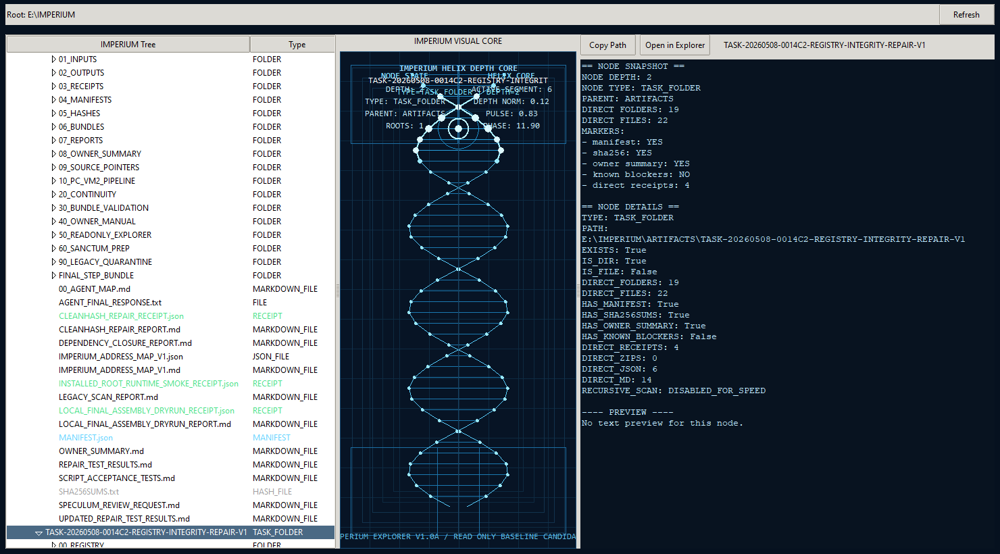

### 030_TASK-20260508-0014D-IMPERIUM-STAGE-COORDINATION-SKELETON-AND-SPECULUM-SNAPSHOT-V1.png

- path: `E:\IMPERIUM\ARTIFACTS\TASK-20260508-0014D-IMPERIUM-STAGE-COORDINATION-SKELETON-AND-SPECULUM-SNAPSHOT-V1`
- source: `truth_audit.sample_task_folders`
- select_status: `SELECTED`
- `PASS` visible_path_matches_target expected=`E:\IMPERIUM\ARTIFACTS\TASK-20260508-0014D-IMPERIUM-STAGE-COORDINATION-SKELETON-AND-SPECULUM-SNAPSHOT-V1`

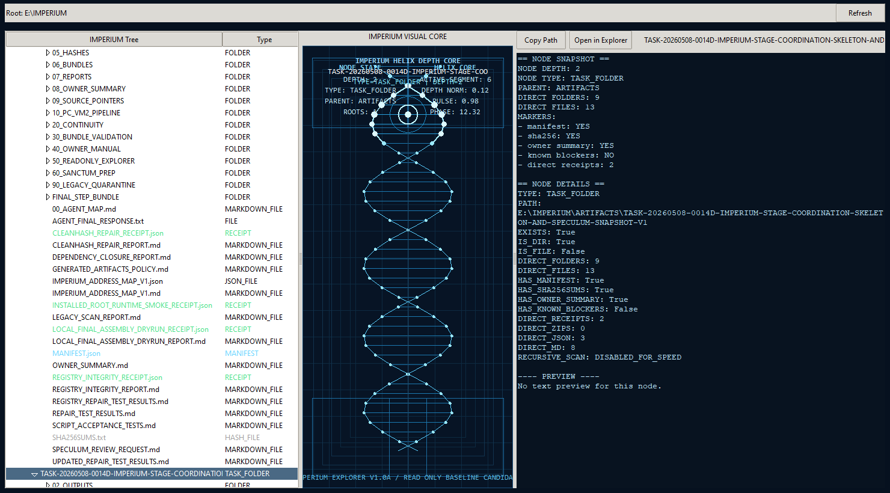

### 031_RECEIPT_SCHEMA_V1_json.png

- path: `E:\IMPERIUM\ARTIFACTS\TASK-20260508-0012-CONTINUITY-PACK-REDACTION-AND-PROTOCOL-REPAIR-V1\02_OUTPUTS\SCHEMAS\RECEIPT_SCHEMA_V1.json`
- source: `truth_audit.sample_receipts`
- select_status: `SELECTED`
- `PASS` visible_path_matches_target expected=`E:\IMPERIUM\ARTIFACTS\TASK-20260508-0012-CONTINUITY-PACK-REDACTION-AND-PROTOCOL-REPAIR-V1\02_OUTPUTS\SCHEMAS\RECEIPT_SCHEMA_V1.json`

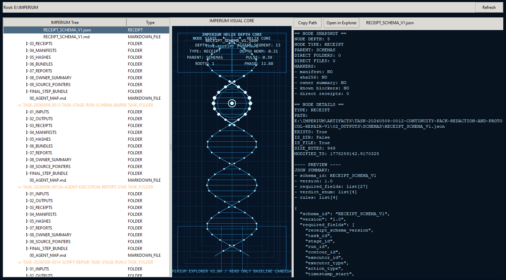

### 032_TOOL_LAYOUT_RECEIPT_json.png

- path: `E:\IMPERIUM\ARTIFACTS\TASK-20260508-0014-SCRIPT-REPAIR-TASK-STAGE-RUN-BARRIER-LEDGER-PROVENANCE-V1\02_OUTPUTS\TOOL_SNAPSHOT\imperium_pipeline\TOOL_LAYOUT_RECEIPT.json`
- source: `truth_audit.sample_receipts`
- select_status: `SELECTED`
- `PASS` visible_path_matches_target expected=`E:\IMPERIUM\ARTIFACTS\TASK-20260508-0014-SCRIPT-REPAIR-TASK-STAGE-RUN-BARRIER-LEDGER-PROVENANCE-V1\02_OUTPUTS\TOOL_SNAPSHOT\imperium_pipeline\TOOL_LAYOUT_RECEIPT.json`

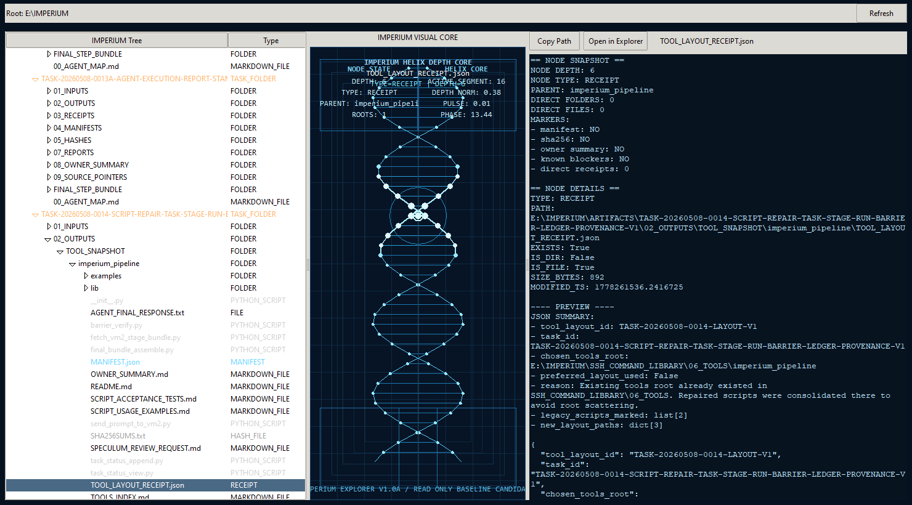

### 033_TOOL_LAYOUT_RECEIPT_json.png

- path: `E:\IMPERIUM\ARTIFACTS\TASK-20260508-0014A-SCRIPT-REPAIR-CLEANUP-LEDGER-FAILURE-RECEIPTS-SHA256-V1\02_OUTPUTS\PATCH_SNAPSHOT\imperium_pipeline_patch\TOOL_LAYOUT_RECEIPT.json`
- source: `truth_audit.sample_receipts`
- select_status: `SELECTED`
- `PASS` visible_path_matches_target expected=`E:\IMPERIUM\ARTIFACTS\TASK-20260508-0014A-SCRIPT-REPAIR-CLEANUP-LEDGER-FAILURE-RECEIPTS-SHA256-V1\02_OUTPUTS\PATCH_SNAPSHOT\imperium_pipeline_patch\TOOL_LAYOUT_RECEIPT.json`

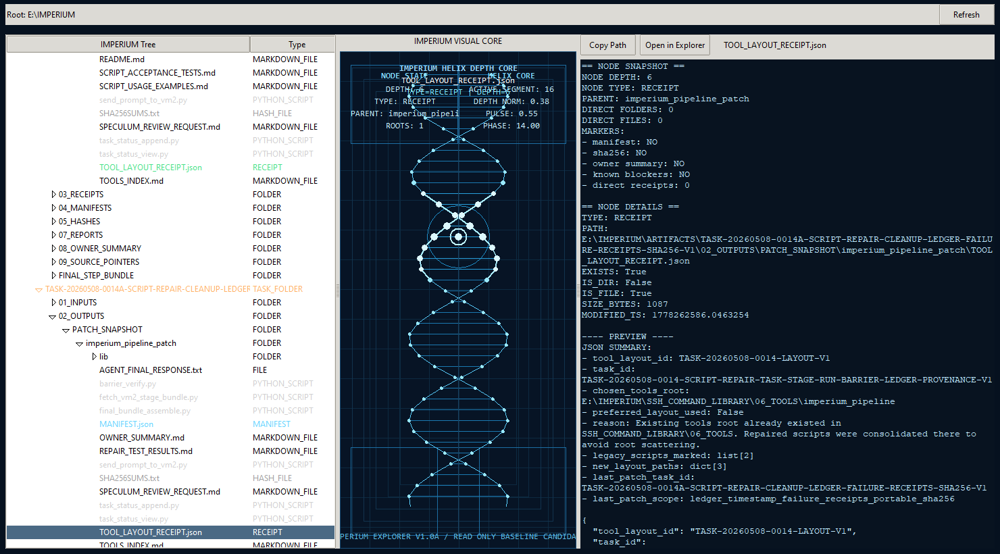

### 034_BARRIER_RECEIPT_json.png

- path: `E:\IMPERIUM\ARTIFACTS\TASK-20260508-0014A-SCRIPT-REPAIR-CLEANUP-LEDGER-FAILURE-RECEIPTS-SHA256-V1\02_OUTPUTS\TEST_WORKSPACE\BARRIER_RECEIPT.json`
- source: `truth_audit.sample_receipts`
- select_status: `SELECTED`
- `PASS` visible_path_matches_target expected=`E:\IMPERIUM\ARTIFACTS\TASK-20260508-0014A-SCRIPT-REPAIR-CLEANUP-LEDGER-FAILURE-RECEIPTS-SHA256-V1\02_OUTPUTS\TEST_WORKSPACE\BARRIER_RECEIPT.json`

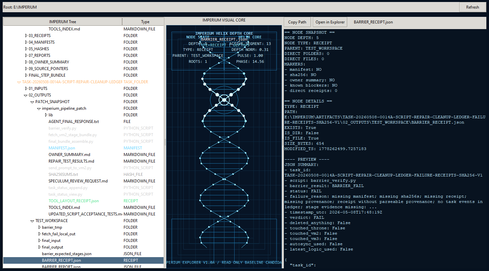

### 035_fetch_fail_FETCH_RECEIPT_json.png

- path: `E:\IMPERIUM\ARTIFACTS\TASK-20260508-0014A-SCRIPT-REPAIR-CLEANUP-LEDGER-FAILURE-RECEIPTS-SHA256-V1\02_OUTPUTS\TEST_WORKSPACE\fetch_fail_FETCH_RECEIPT.json`
- source: `truth_audit.sample_receipts`
- select_status: `SELECTED`
- `PASS` visible_path_matches_target expected=`E:\IMPERIUM\ARTIFACTS\TASK-20260508-0014A-SCRIPT-REPAIR-CLEANUP-LEDGER-FAILURE-RECEIPTS-SHA256-V1\02_OUTPUTS\TEST_WORKSPACE\fetch_fail_FETCH_RECEIPT.json`

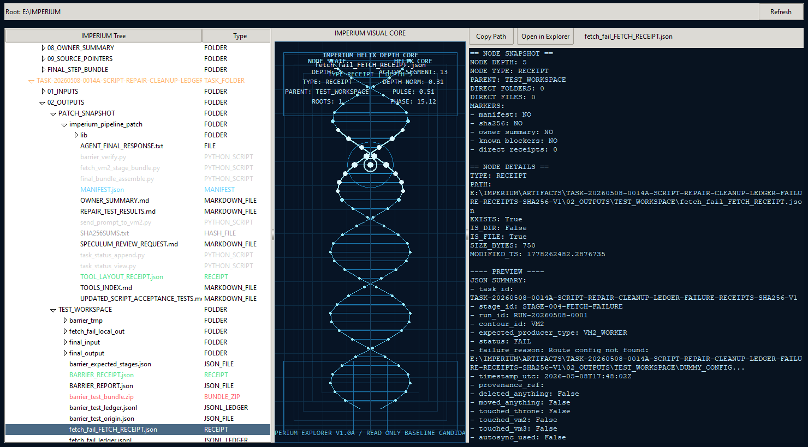

### 036_latest_reject_DISPATCH_RECEIPT_json.png

- path: `E:\IMPERIUM\ARTIFACTS\TASK-20260508-0014A-SCRIPT-REPAIR-CLEANUP-LEDGER-FAILURE-RECEIPTS-SHA256-V1\02_OUTPUTS\TEST_WORKSPACE\latest_reject_DISPATCH_RECEIPT.json`
- source: `truth_audit.sample_receipts`
- select_status: `SELECTED`
- `PASS` visible_path_matches_target expected=`E:\IMPERIUM\ARTIFACTS\TASK-20260508-0014A-SCRIPT-REPAIR-CLEANUP-LEDGER-FAILURE-RECEIPTS-SHA256-V1\02_OUTPUTS\TEST_WORKSPACE\latest_reject_DISPATCH_RECEIPT.json`

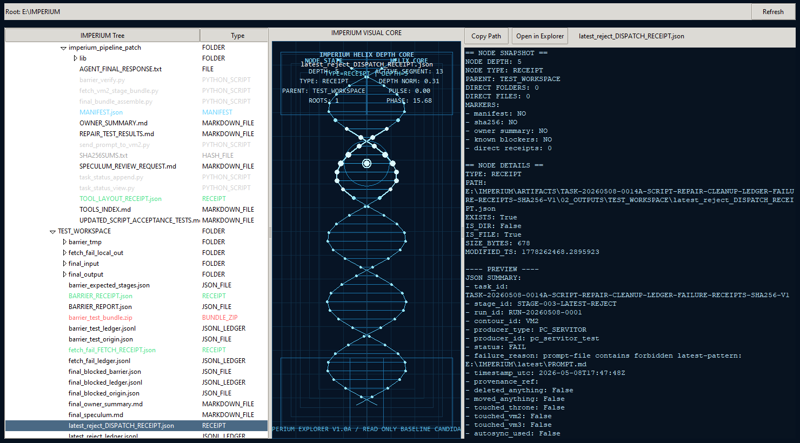

### 037_send_fail_DISPATCH_RECEIPT_json.png

- path: `E:\IMPERIUM\ARTIFACTS\TASK-20260508-0014A-SCRIPT-REPAIR-CLEANUP-LEDGER-FAILURE-RECEIPTS-SHA256-V1\02_OUTPUTS\TEST_WORKSPACE\send_fail_DISPATCH_RECEIPT.json`
- source: `truth_audit.sample_receipts`
- select_status: `SELECTED`
- `PASS` visible_path_matches_target expected=`E:\IMPERIUM\ARTIFACTS\TASK-20260508-0014A-SCRIPT-REPAIR-CLEANUP-LEDGER-FAILURE-RECEIPTS-SHA256-V1\02_OUTPUTS\TEST_WORKSPACE\send_fail_DISPATCH_RECEIPT.json`

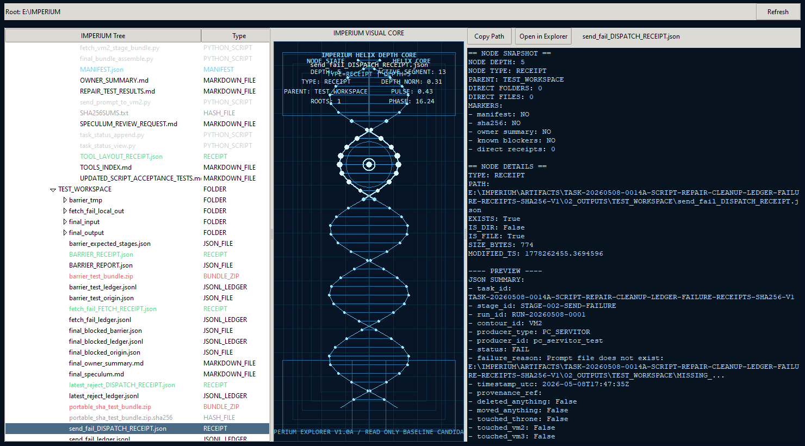

### 038_FINAL_ASSEMBLY_RECEIPT_json.png

- path: `E:\IMPERIUM\ARTIFACTS\TASK-20260508-0014A-SCRIPT-REPAIR-CLEANUP-LEDGER-FAILURE-RECEIPTS-SHA256-V1\02_OUTPUTS\TEST_WORKSPACE\final_output\FINAL_ASSEMBLY_RECEIPT.json`
- source: `truth_audit.sample_receipts`
- select_status: `SELECTED`
- `PASS` visible_path_matches_target expected=`E:\IMPERIUM\ARTIFACTS\TASK-20260508-0014A-SCRIPT-REPAIR-CLEANUP-LEDGER-FAILURE-RECEIPTS-SHA256-V1\02_OUTPUTS\TEST_WORKSPACE\final_output\FINAL_ASSEMBLY_RECEIPT.json`

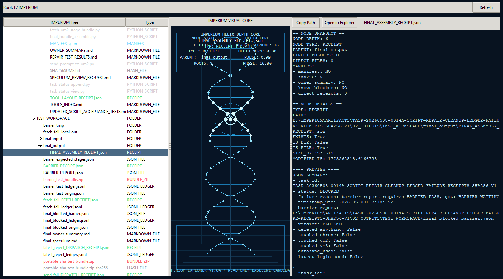

### 039_MANIFEST_json.png

- path: `E:\IMPERIUM\ARTIFACTS\TASK-20260508-0013-TASK-STAGE-RUN-SCHEMA-BARRIER-AND-PROVENANCE-V1\02_OUTPUTS\PROTOCOL_V1\MANIFEST.json`
- source: `truth_audit.sample_manifests`
- select_status: `SELECTED`
- `PASS` visible_path_matches_target expected=`E:\IMPERIUM\ARTIFACTS\TASK-20260508-0013-TASK-STAGE-RUN-SCHEMA-BARRIER-AND-PROVENANCE-V1\02_OUTPUTS\PROTOCOL_V1\MANIFEST.json`

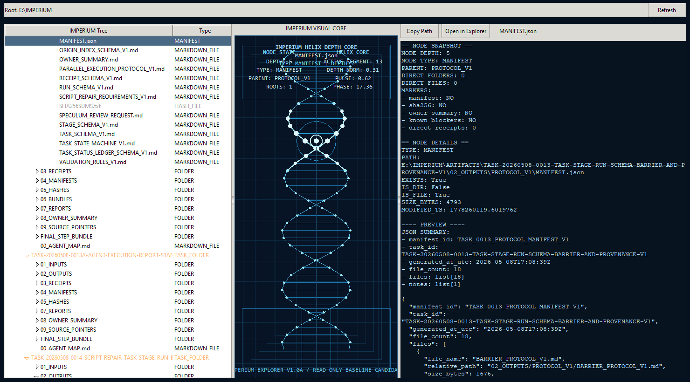

### 040_MANIFEST_json.png

- path: `E:\IMPERIUM\ARTIFACTS\TASK-20260508-0014-SCRIPT-REPAIR-TASK-STAGE-RUN-BARRIER-LEDGER-PROVENANCE-V1\02_OUTPUTS\TOOL_SNAPSHOT\imperium_pipeline\MANIFEST.json`
- source: `truth_audit.sample_manifests`
- select_status: `SELECTED`
- `PASS` visible_path_matches_target expected=`E:\IMPERIUM\ARTIFACTS\TASK-20260508-0014-SCRIPT-REPAIR-TASK-STAGE-RUN-BARRIER-LEDGER-PROVENANCE-V1\02_OUTPUTS\TOOL_SNAPSHOT\imperium_pipeline\MANIFEST.json`

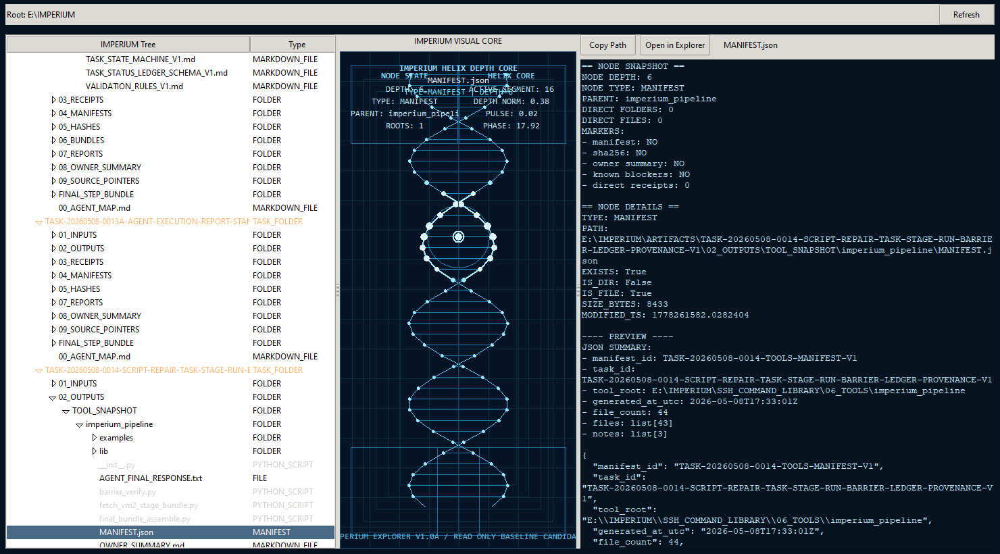

### 041_MANIFEST_json.png

- path: `E:\IMPERIUM\ARTIFACTS\TASK-20260508-0014A-SCRIPT-REPAIR-CLEANUP-LEDGER-FAILURE-RECEIPTS-SHA256-V1\02_OUTPUTS\PATCH_SNAPSHOT\imperium_pipeline_patch\MANIFEST.json`
- source: `truth_audit.sample_manifests`
- select_status: `SELECTED`
- `PASS` visible_path_matches_target expected=`E:\IMPERIUM\ARTIFACTS\TASK-20260508-0014A-SCRIPT-REPAIR-CLEANUP-LEDGER-FAILURE-RECEIPTS-SHA256-V1\02_OUTPUTS\PATCH_SNAPSHOT\imperium_pipeline_patch\MANIFEST.json`

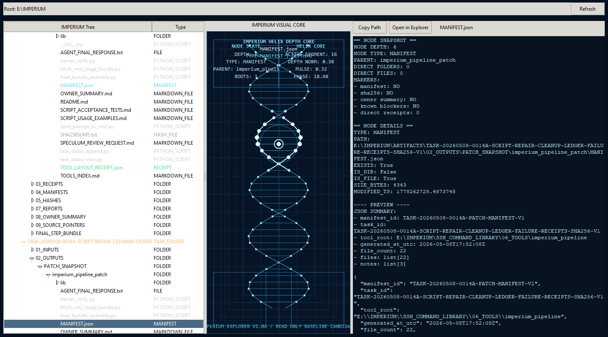

### 042_MANIFEST_json.png

- path: `E:\IMPERIUM\ARTIFACTS\TASK-20260508-0014B-FINAL-ASSEMBLY-HASH-PROVENANCE-ZIP-HYGIENE-V1\02_OUTPUTS\PATCH_SNAPSHOT\imperium_pipeline_patch\MANIFEST.json`
- source: `truth_audit.sample_manifests`
- select_status: `SELECTED`
- `PASS` visible_path_matches_target expected=`E:\IMPERIUM\ARTIFACTS\TASK-20260508-0014B-FINAL-ASSEMBLY-HASH-PROVENANCE-ZIP-HYGIENE-V1\02_OUTPUTS\PATCH_SNAPSHOT\imperium_pipeline_patch\MANIFEST.json`

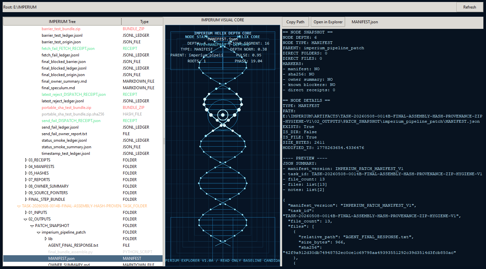

### 043_MANIFEST_json.png

- path: `E:\IMPERIUM\ARTIFACTS\TASK-20260508-0014B-FINAL-ASSEMBLY-HASH-PROVENANCE-ZIP-HYGIENE-V1\02_OUTPUTS\TEST_WORKSPACE\extracted_bundle\MANIFEST.json`
- source: `truth_audit.sample_manifests`
- select_status: `SELECTED`
- `PASS` visible_path_matches_target expected=`E:\IMPERIUM\ARTIFACTS\TASK-20260508-0014B-FINAL-ASSEMBLY-HASH-PROVENANCE-ZIP-HYGIENE-V1\02_OUTPUTS\TEST_WORKSPACE\extracted_bundle\MANIFEST.json`

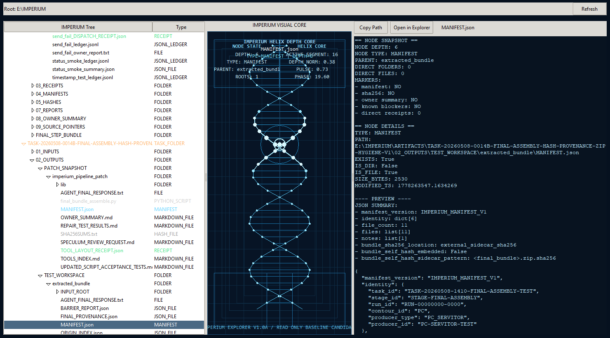

### 044_MANIFEST_json.png

- path: `E:\IMPERIUM\ARTIFACTS\TASK-20260508-0014B-FINAL-ASSEMBLY-HASH-PROVENANCE-ZIP-HYGIENE-V1\02_OUTPUTS\TEST_WORKSPACE\final_output\TASK-20260508-1410-FINAL-ASSEMBLY-TEST_FINAL_TASK_BUNDLE_CONTENT\MANIFEST.json`
- source: `truth_audit.sample_manifests`
- select_status: `SELECTED`
- `PASS` visible_path_matches_target expected=`E:\IMPERIUM\ARTIFACTS\TASK-20260508-0014B-FINAL-ASSEMBLY-HASH-PROVENANCE-ZIP-HYGIENE-V1\02_OUTPUTS\TEST_WORKSPACE\final_output\TASK-20260508-1410-FINAL-ASSEMBLY-TEST_FINAL_TASK_BUNDLE_CONTENT\MANIFEST.json`

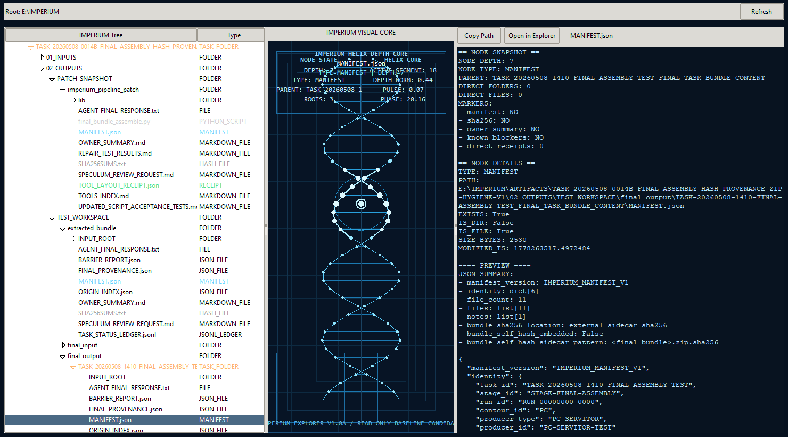

### 045_MANIFEST_json.png

- path: `E:\IMPERIUM\ARTIFACTS\TASK-20260508-0014B-FINAL-ASSEMBLY-HASH-PROVENANCE-ZIP-HYGIENE-V1\02_OUTPUTS\TEST_WORKSPACE\final_output\TASK-TEST-0014B-OK_FINAL_TASK_BUNDLE_CONTENT\MANIFEST.json`
- source: `truth_audit.sample_manifests`
- select_status: `SELECTED`
- `PASS` visible_path_matches_target expected=`E:\IMPERIUM\ARTIFACTS\TASK-20260508-0014B-FINAL-ASSEMBLY-HASH-PROVENANCE-ZIP-HYGIENE-V1\02_OUTPUTS\TEST_WORKSPACE\final_output\TASK-TEST-0014B-OK_FINAL_TASK_BUNDLE_CONTENT\MANIFEST.json`

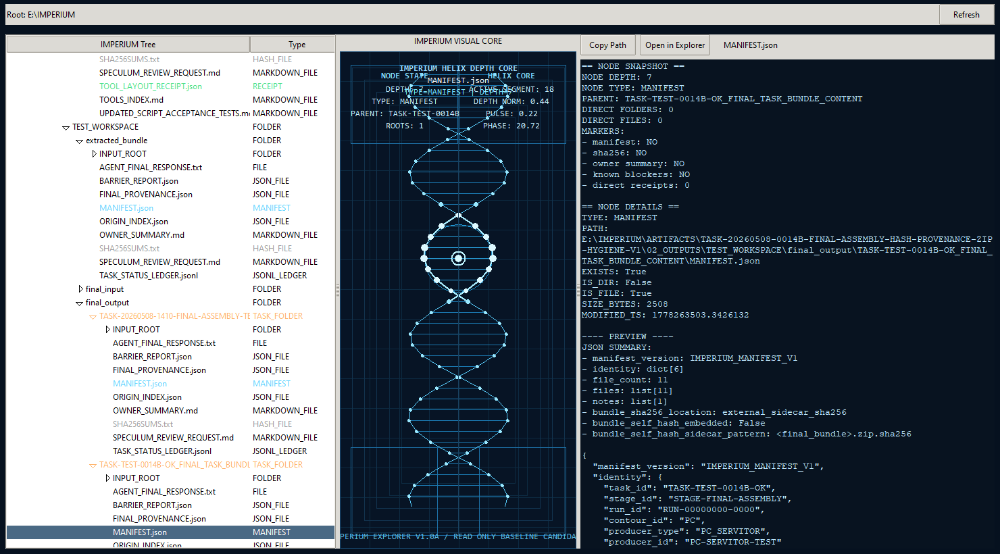

### 046_MANIFEST_json.png

- path: `E:\IMPERIUM\ARTIFACTS\TASK-20260508-0014B-FINAL-ASSEMBLY-HASH-PROVENANCE-ZIP-HYGIENE-V1\02_OUTPUTS\TEST_WORKSPACE\patch_bundle_extract\MANIFEST.json`
- source: `truth_audit.sample_manifests`
- select_status: `SELECTED`
- `PASS` visible_path_matches_target expected=`E:\IMPERIUM\ARTIFACTS\TASK-20260508-0014B-FINAL-ASSEMBLY-HASH-PROVENANCE-ZIP-HYGIENE-V1\02_OUTPUTS\TEST_WORKSPACE\patch_bundle_extract\MANIFEST.json`

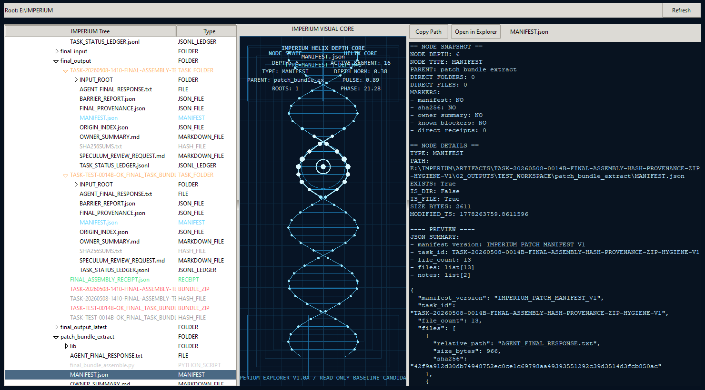

### 047_TASK-20260508-0003-IMPERIUM-ROOT-MAP-ARTIFACT-ROUTING_FINAL_STEP_BUNDLE_zip.png

- path: `E:\IMPERIUM\ARTIFACTS\TASK-20260508-0003-IMPERIUM-ROOT-MAP-ARTIFACT-ROUTING\FINAL_STEP_BUNDLE\TASK-20260508-0003-IMPERIUM-ROOT-MAP-ARTIFACT-ROUTING_FINAL_STEP_BUNDLE.zip`
- source: `truth_audit.sample_bundles`
- select_status: `SELECTED`
- `PASS` visible_path_matches_target expected=`E:\IMPERIUM\ARTIFACTS\TASK-20260508-0003-IMPERIUM-ROOT-MAP-ARTIFACT-ROUTING\FINAL_STEP_BUNDLE\TASK-20260508-0003-IMPERIUM-ROOT-MAP-ARTIFACT-ROUTING_FINAL_STEP_BUNDLE.zip`

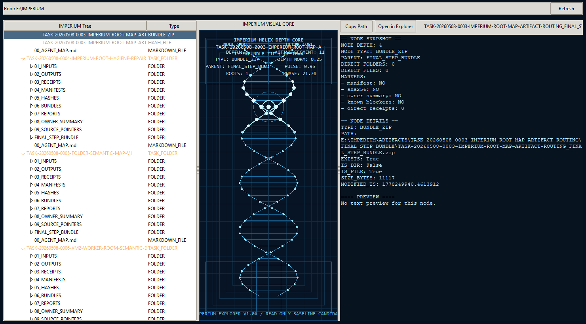

### 048_IMPERIUM_LIGHT_SNAPSHOT_20260507_164459_zip.png

- path: `E:\IMPERIUM\ARTIFACTS\TASK-20260508-0004-IMPERIUM-ROOT-HYGIENE-REPAIR\01_INPUTS\ROOT_LEVEL_FILES_MOVED_FROM_ROOT\IMPERIUM_LIGHT_SNAPSHOT_20260507_164459.zip`
- source: `truth_audit.sample_bundles`
- select_status: `SELECTED`
- `PASS` visible_path_matches_target expected=`E:\IMPERIUM\ARTIFACTS\TASK-20260508-0004-IMPERIUM-ROOT-HYGIENE-REPAIR\01_INPUTS\ROOT_LEVEL_FILES_MOVED_FROM_ROOT\IMPERIUM_LIGHT_SNAPSHOT_20260507_164459.zip`

### 049_PC_ARTIFACTS_VAULT_BOOTSTRAP_AND_VM2_ROUTE_PROOF_REGISTRATION_20260508_1703_zip.png

- path: `E:\IMPERIUM\ARTIFACTS\TASK-20260508-0004-IMPERIUM-ROOT-HYGIENE-REPAIR\01_INPUTS\ROOT_LEVEL_FILES_MOVED_FROM_ROOT\PC_ARTIFACTS_VAULT_BOOTSTRAP_AND_VM2_ROUTE_PROOF_REGISTRATION_20260508_1703.zip`
- source: `truth_audit.sample_bundles`
- select_status: `SELECTED`
- `PASS` visible_path_matches_target expected=`E:\IMPERIUM\ARTIFACTS\TASK-20260508-0004-IMPERIUM-ROOT-HYGIENE-REPAIR\01_INPUTS\ROOT_LEVEL_FILES_MOVED_FROM_ROOT\PC_ARTIFACTS_VAULT_BOOTSTRAP_AND_VM2_ROUTE_PROOF_REGISTRATION_20260508_1703.zip`

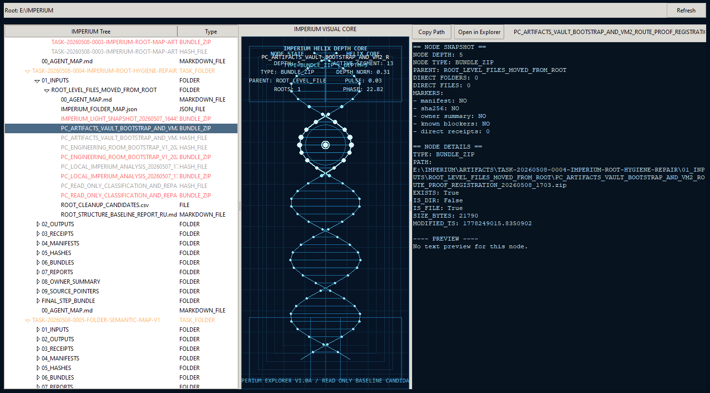

### 050_PC_ENGINEERING_ROOM_BOOTSTRAP_V1_20260508_1344_zip.png

- path: `E:\IMPERIUM\ARTIFACTS\TASK-20260508-0004-IMPERIUM-ROOT-HYGIENE-REPAIR\01_INPUTS\ROOT_LEVEL_FILES_MOVED_FROM_ROOT\PC_ENGINEERING_ROOM_BOOTSTRAP_V1_20260508_1344.zip`
- source: `truth_audit.sample_bundles`
- select_status: `SELECTED`
- `PASS` visible_path_matches_target expected=`E:\IMPERIUM\ARTIFACTS\TASK-20260508-0004-IMPERIUM-ROOT-HYGIENE-REPAIR\01_INPUTS\ROOT_LEVEL_FILES_MOVED_FROM_ROOT\PC_ENGINEERING_ROOM_BOOTSTRAP_V1_20260508_1344.zip`

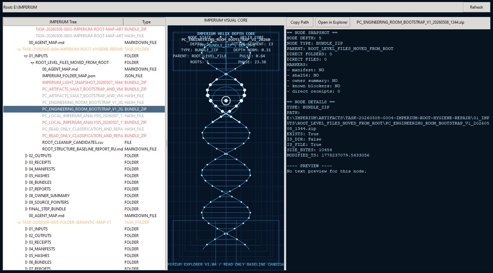

### 051_PC_LOCAL_IMPERIUM_ANALYSIS_20260507_1711_zip.png

- path: `E:\IMPERIUM\ARTIFACTS\TASK-20260508-0004-IMPERIUM-ROOT-HYGIENE-REPAIR\01_INPUTS\ROOT_LEVEL_FILES_MOVED_FROM_ROOT\PC_LOCAL_IMPERIUM_ANALYSIS_20260507_1711.zip`
- source: `truth_audit.sample_bundles`
- select_status: `SELECTED`
- `PASS` visible_path_matches_target expected=`E:\IMPERIUM\ARTIFACTS\TASK-20260508-0004-IMPERIUM-ROOT-HYGIENE-REPAIR\01_INPUTS\ROOT_LEVEL_FILES_MOVED_FROM_ROOT\PC_LOCAL_IMPERIUM_ANALYSIS_20260507_1711.zip`

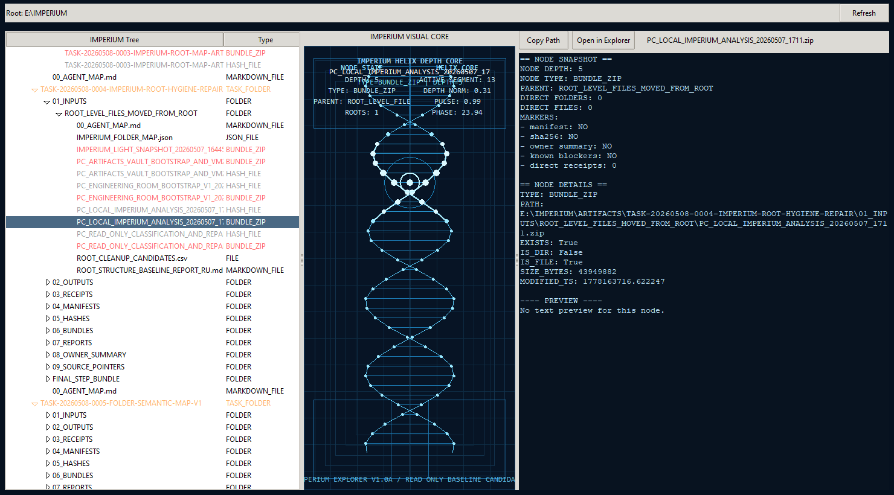

### 052_ASTRA.png

- path: `E:\IMPERIUM\ARTIFACTS\TASK-20260508-0014E-STAGE-COORDINATION-RUNTIME-MINIMAL-IMPLEMENTATION-V1\TEST_FIXTURES\TASK-LOCAL-0014E-RUNTIME-PRIMITIVES-DRYRUN\ASTRA`
- source: `truth_audit.sample_organ_scaffolds`
- select_status: `SELECTED`
- `PASS` visible_path_matches_target expected=`E:\IMPERIUM\ARTIFACTS\TASK-20260508-0014E-STAGE-COORDINATION-RUNTIME-MINIMAL-IMPLEMENTATION-V1\TEST_FIXTURES\TASK-LOCAL-0014E-RUNTIME-PRIMITIVES-DRYRUN\ASTRA`

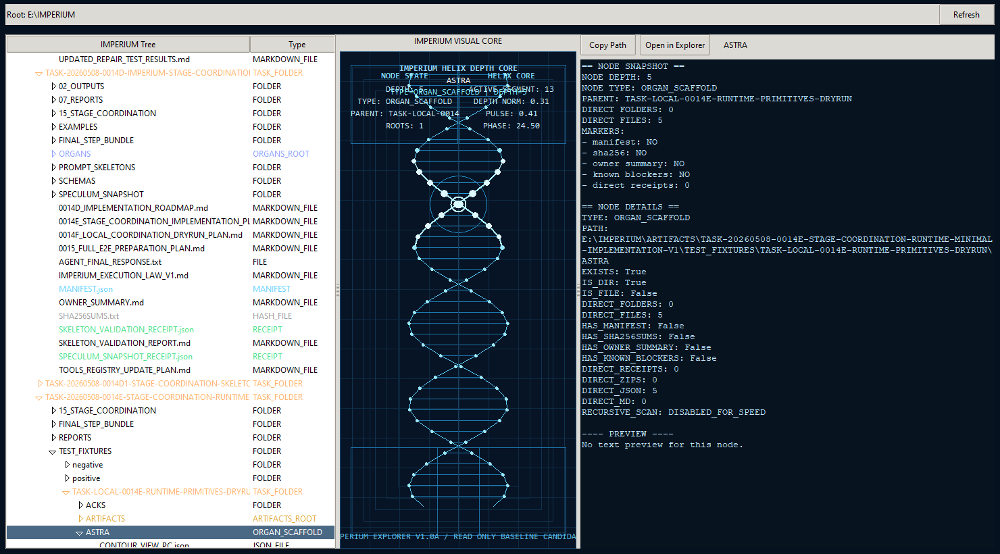

### 053_ASTRA.png

- path: `E:\IMPERIUM\ARTIFACTS\TASK-20260508-0014E1-RUNTIME-EVIDENCE-PACKAGING-REPAIR-V1\FINAL_STEP_BUNDLE\_VERIFY_EXTRACT_0014E1_MANUAL\TEST_FIXTURES\TASK-LOCAL-0014E-RUNTIME-PRIMITIVES-DRYRUN\ASTRA`
- source: `truth_audit.sample_organ_scaffolds`
- select_status: `SELECTED`
- `PASS` visible_path_matches_target expected=`E:\IMPERIUM\ARTIFACTS\TASK-20260508-0014E1-RUNTIME-EVIDENCE-PACKAGING-REPAIR-V1\FINAL_STEP_BUNDLE\_VERIFY_EXTRACT_0014E1_MANUAL\TEST_FIXTURES\TASK-LOCAL-0014E-RUNTIME-PRIMITIVES-DRYRUN\ASTRA`

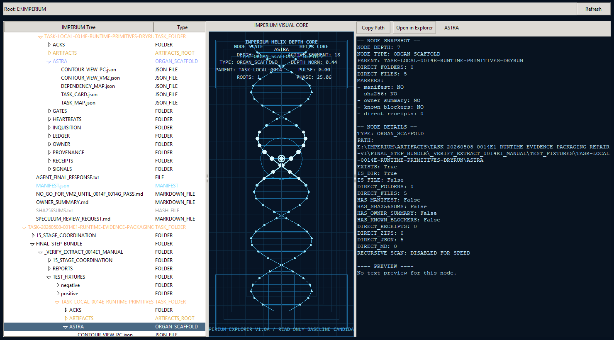

### 054_ASTRA.png

- path: `E:\IMPERIUM\ARTIFACTS\TASK-20260508-0014E1-RUNTIME-EVIDENCE-PACKAGING-REPAIR-V1\TEST_FIXTURES\TASK-LOCAL-0014E-RUNTIME-PRIMITIVES-DRYRUN\ASTRA`
- source: `truth_audit.sample_organ_scaffolds`
- select_status: `SELECTED`
- `PASS` visible_path_matches_target expected=`E:\IMPERIUM\ARTIFACTS\TASK-20260508-0014E1-RUNTIME-EVIDENCE-PACKAGING-REPAIR-V1\TEST_FIXTURES\TASK-LOCAL-0014E-RUNTIME-PRIMITIVES-DRYRUN\ASTRA`

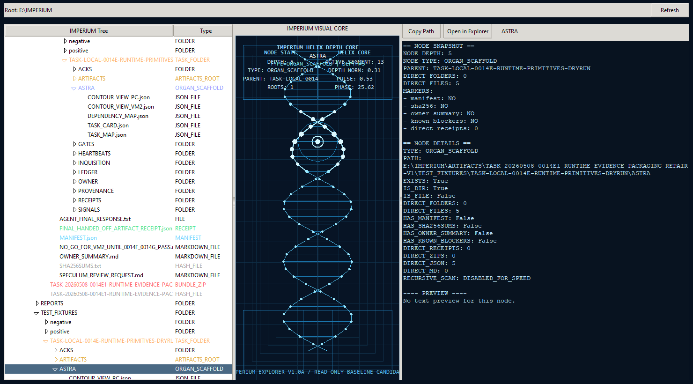

### 055_astronomicon.png

- path: `E:\IMPERIUM\OBSERVED\THRONE_REPO_COPY\FULL_COPY\IMPERIUM\CANON\DOCTRINE\astronomicon`
- source: `truth_audit.sample_organ_scaffolds`
- select_status: `SELECTED`
- `PASS` visible_path_matches_target expected=`E:\IMPERIUM\OBSERVED\THRONE_REPO_COPY\FULL_COPY\IMPERIUM\CANON\DOCTRINE\astronomicon`

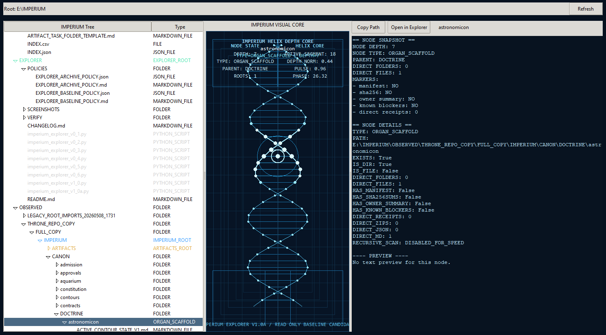

### 056_astronomicon.png

- path: `E:\IMPERIUM\OBSERVED\THRONE_REPO_COPY\FULL_COPY\IMPERIUM\CANON\registry\astronomicon`
- source: `truth_audit.sample_organ_scaffolds`
- select_status: `SELECTED`
- `PASS` visible_path_matches_target expected=`E:\IMPERIUM\OBSERVED\THRONE_REPO_COPY\FULL_COPY\IMPERIUM\CANON\registry\astronomicon`

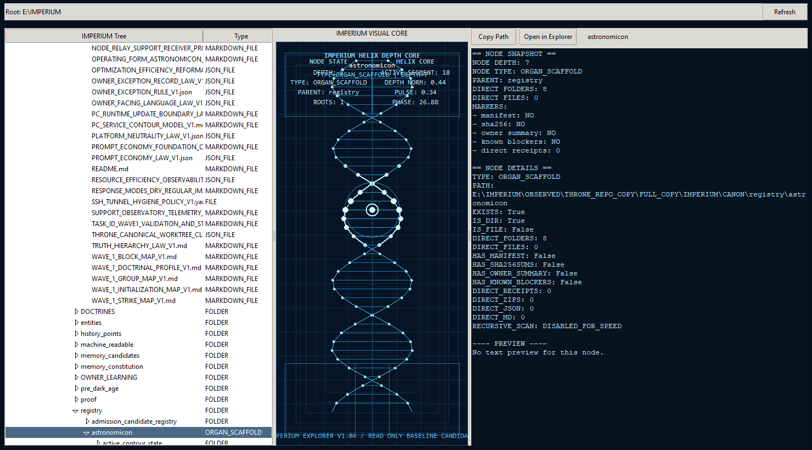

### 057_administratum.png

- path: `E:\IMPERIUM\OBSERVED\THRONE_REPO_COPY\FULL_COPY\IMPERIUM\runtime\administratum`
- source: `truth_audit.sample_organ_scaffolds`
- select_status: `SELECTED`
- `PASS` visible_path_matches_target expected=`E:\IMPERIUM\OBSERVED\THRONE_REPO_COPY\FULL_COPY\IMPERIUM\runtime\administratum`

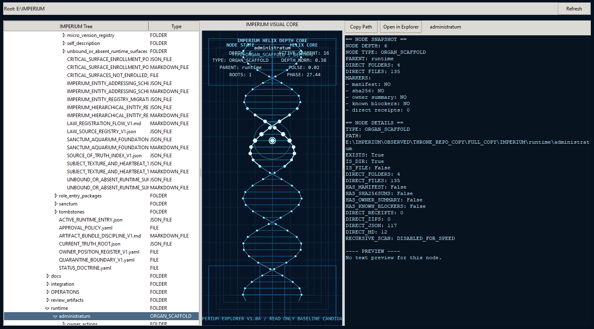

### 058_administratum.png

- path: `E:\IMPERIUM\OBSERVED\VM3_REPO_COPY\FULL_COPY\IMPERIUM\runtime\administratum`
- source: `truth_audit.sample_organ_scaffolds`
- select_status: `SELECTED`
- `PASS` visible_path_matches_target expected=`E:\IMPERIUM\OBSERVED\VM3_REPO_COPY\FULL_COPY\IMPERIUM\runtime\administratum`

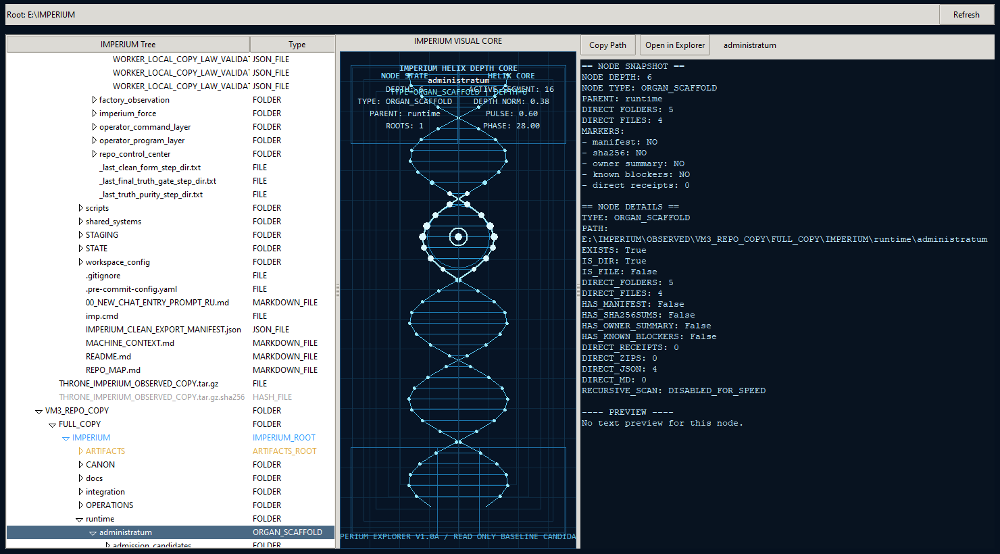

### 059_administratum.png

- path: `E:\IMPERIUM\OBSERVED\VM3_REPO_COPY\FULL_COPY\IMPERIUM\STAGING\bridge_exchange\sanctum_tasks\vm3_inbox\STEP_VM3_CONTOUR_WORKER_HEARTBEAT_AND_HANDOFF_FOUNDATION_V1_20260426T212732Z\surfaces_snapshot\runtime\administratum`
- source: `truth_audit.sample_organ_scaffolds`
- select_status: `SELECTED`
- `PASS` visible_path_matches_target expected=`E:\IMPERIUM\OBSERVED\VM3_REPO_COPY\FULL_COPY\IMPERIUM\STAGING\bridge_exchange\sanctum_tasks\vm3_inbox\STEP_VM3_CONTOUR_WORKER_HEARTBEAT_AND_HANDOFF_FOUNDATION_V1_20260426T212732Z\surfaces_snapshot\runtime\administratum`

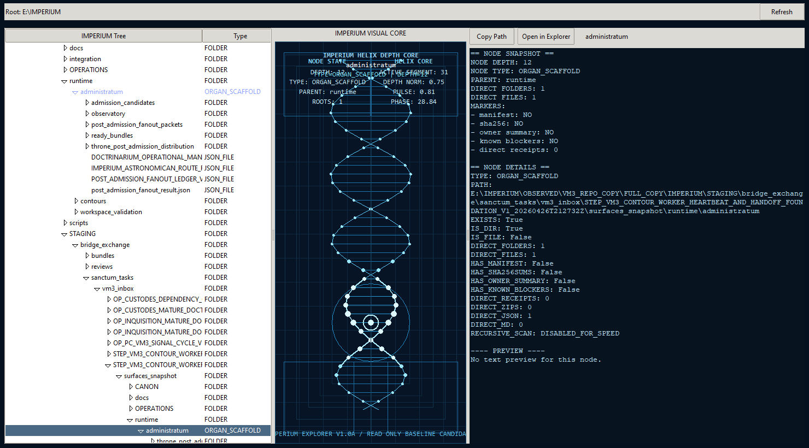

### 060_OBSERVED.png

- path: `E:\IMPERIUM\OBSERVED`
- source: `root_direct_child`
- select_status: `SELECTED`
- `PASS` visible_path_matches_target expected=`E:\IMPERIUM\OBSERVED`

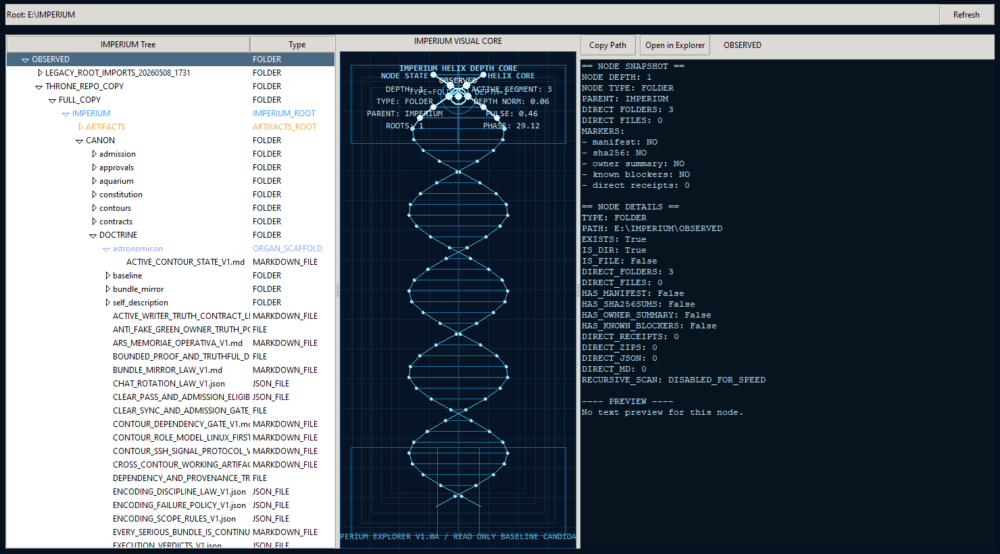

### 061_PC_ENGINEERING_ROOM.png

- path: `E:\IMPERIUM\PC_ENGINEERING_ROOM`
- source: `root_direct_child`
- select_status: `SELECTED`
- `PASS` visible_path_matches_target expected=`E:\IMPERIUM\PC_ENGINEERING_ROOM`

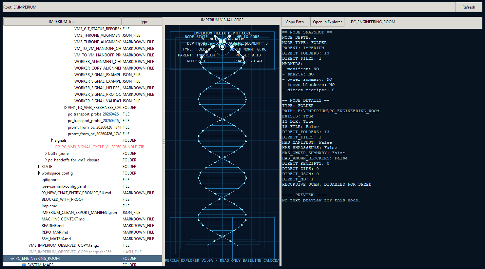

### 062_SSH_COMMAND_LIBRARY.png

- path: `E:\IMPERIUM\SSH_COMMAND_LIBRARY`
- source: `root_direct_child`
- select_status: `SELECTED`
- `PASS` visible_path_matches_target expected=`E:\IMPERIUM\SSH_COMMAND_LIBRARY`

### 063_imperium_explorer_v0_3_py.png

- path: `E:\IMPERIUM\EXPLORER\imperium_explorer_v0_3.py`
- source: `explorer_control_files`
- select_status: `SELECTED`
- `PASS` visible_path_matches_target expected=`E:\IMPERIUM\EXPLORER\imperium_explorer_v0_3.py`

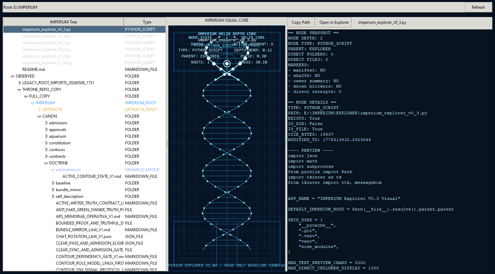

### 064_imperium_explorer_v0_4_py.png

- path: `E:\IMPERIUM\EXPLORER\imperium_explorer_v0_4.py`
- source: `explorer_control_files`
- select_status: `SELECTED`
- `PASS` visible_path_matches_target expected=`E:\IMPERIUM\EXPLORER\imperium_explorer_v0_4.py`

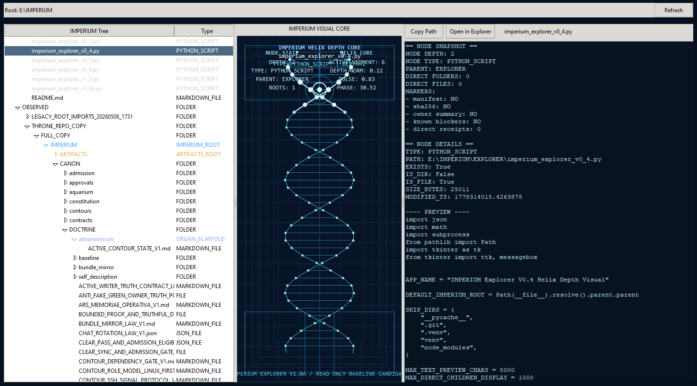

### 065_imperium_explorer_v0_5_py.png

- path: `E:\IMPERIUM\EXPLORER\imperium_explorer_v0_5.py`
- source: `explorer_control_files`
- select_status: `SELECTED`
- `PASS` visible_path_matches_target expected=`E:\IMPERIUM\EXPLORER\imperium_explorer_v0_5.py`

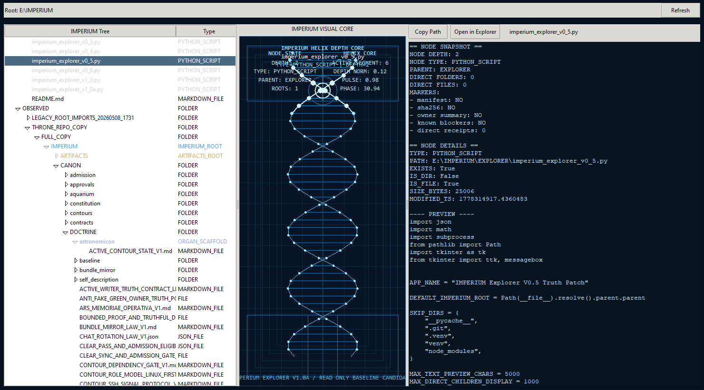

### 066_VERIFY.png

- path: `E:\IMPERIUM\EXPLORER\VERIFY`
- source: `explorer_control_files`
- select_status: `SELECTED`
- `PASS` visible_path_matches_target expected=`E:\IMPERIUM\EXPLORER\VERIFY`

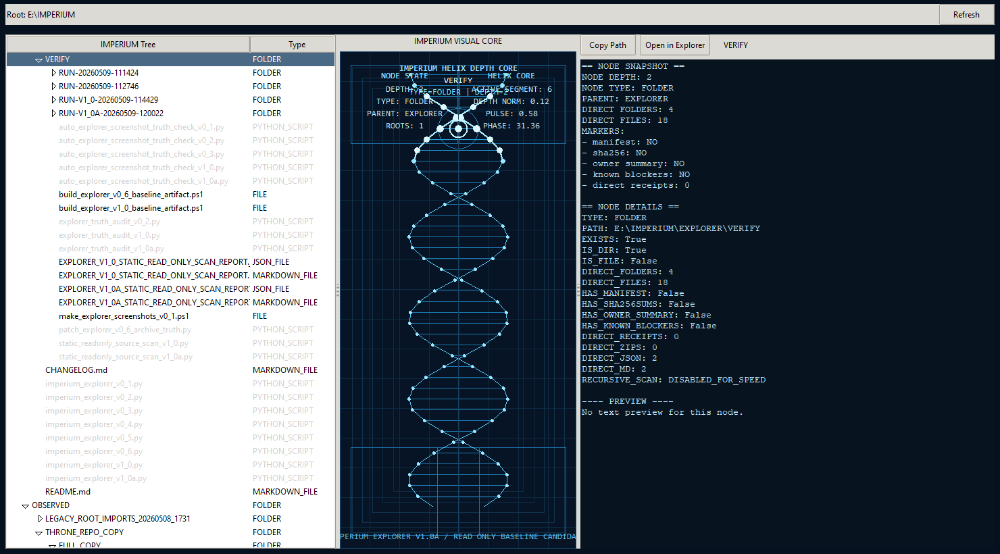

### 067_SCREENSHOTS.png

- path: `E:\IMPERIUM\EXPLORER\SCREENSHOTS`
- source: `explorer_control_files`
- select_status: `SELECTED`
- `PASS` visible_path_matches_target expected=`E:\IMPERIUM\EXPLORER\SCREENSHOTS`

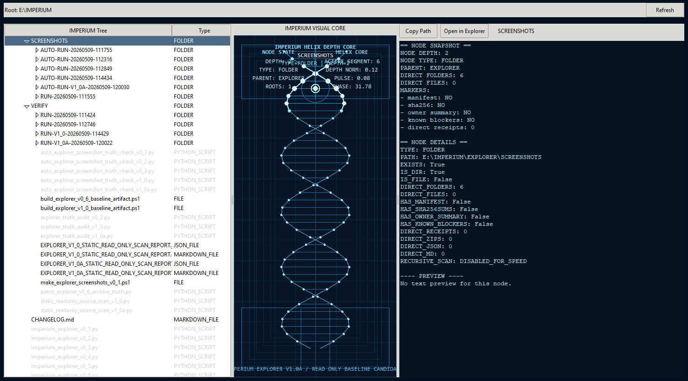
